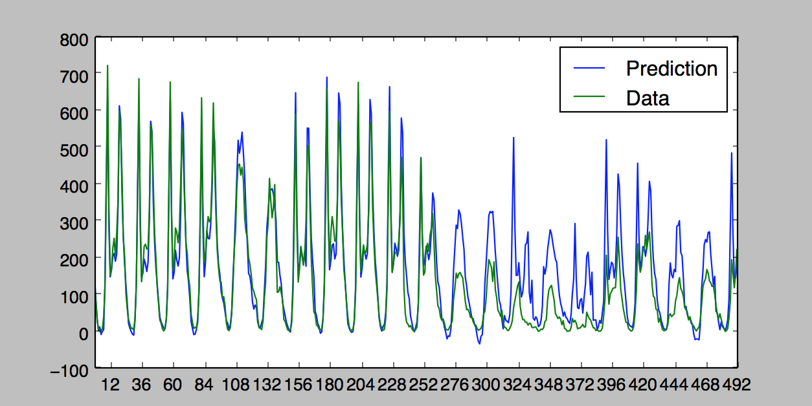

#Bike-Sharing

In this project, I build a neural network from scratch to carry out a prediction problem on a real dataset! By building a neural network from the ground up, I have a much better understanding of gradient descent, backpropagation, and other concepts that are important to know before we move to higher level tools such as Tensorflow.

## Setup

### Prerequisites
- Linux
- Python with numpy
- matplotlib

### Getting Started
- Clone this repo:
```bash
git clone https://github.com/zhaozhichao4515/Bike-Sharing
cd Bike-Sharing 
```
- Download the dataset (script borrowed from [torch code](https://github.com/phillipi/pix2pix/blob/master/datasets/download_dataset.sh)):
```bash
bash ./download_dataset.sh
```
- Run the model
```bash
python main.py 
```
## Results
Training loss: 0.0524    Validation loss: 0.0570


Predict result: